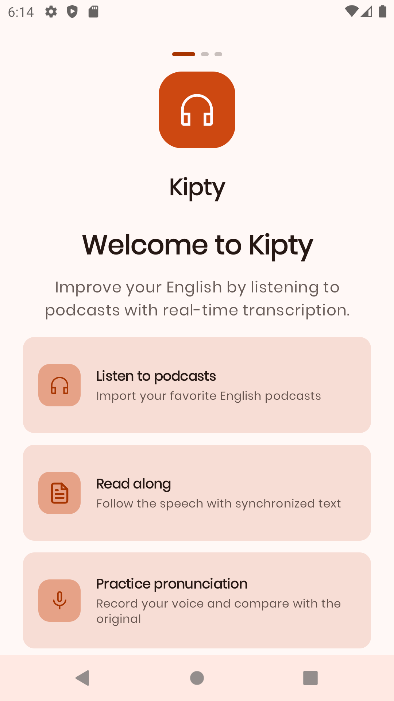
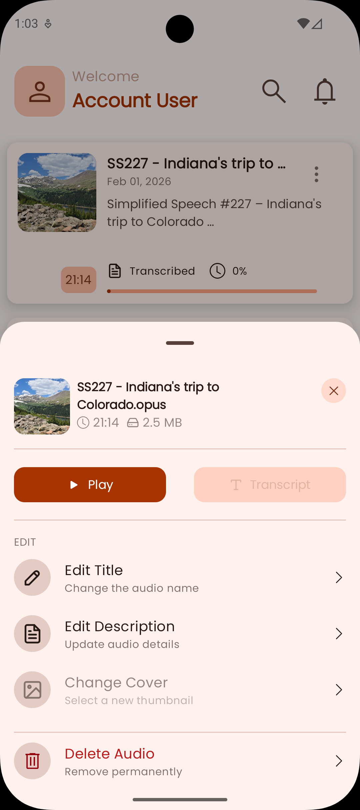
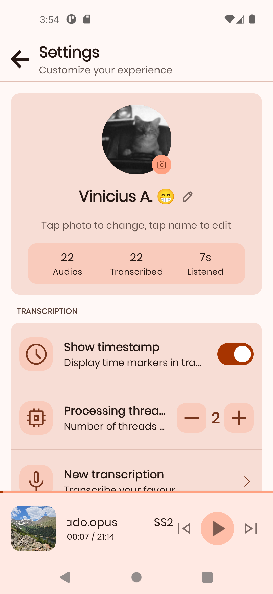
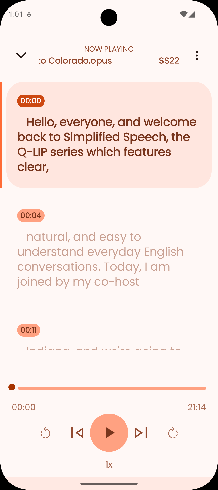
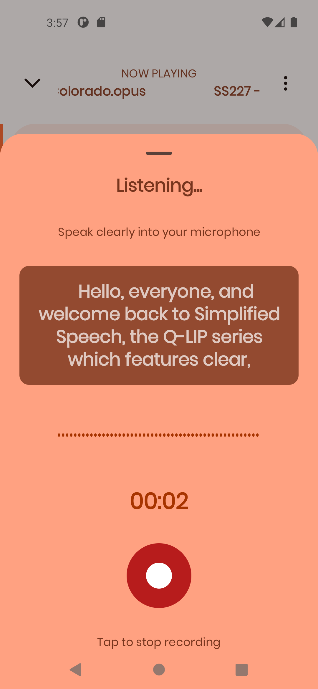
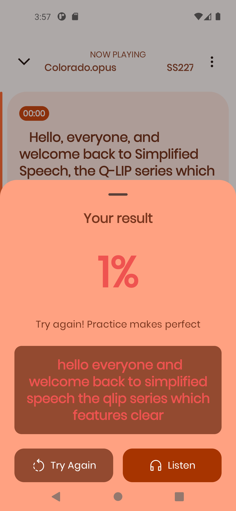
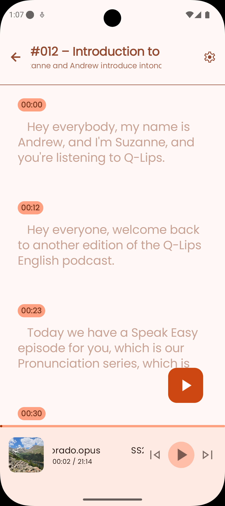

<p align="center">
  
</p>

<p align="center">
  
  
  
</p>

<h3 align="center">
  Mobile app for audio transcription focused on English learning
</h3>

> **Note:** Audio transcriptions in Kipty are generated using the *base* and *tiny* Whisper.cpp models. As these are lightweight models, transcription errors may occur, especially with noisy audio or fast speech.

Kipty is a mobile application designed to create **audio transcriptions** to help with learning English.  
It allows you to follow along with what is being said in an audio while reading its transcription, which is especially useful for improving listening and vocabulary.

Originally created as a personal tool to support my own English-learning journey, Kipty is most commonly used to transcribe **podcast audio**, but it can be applied to any supported audio source.

---

## 🚀 Goals

The main goal of Kipty is to:

- support English learners
- improve listening comprehension
- make podcast/audio study easier
- provide a simple transcription management tool

---

## 📸 Screenshots

| | | |
|---|---|---|
|  |  |  |
|  |  |  |
|  |  |  |

## 📥 Installation

> [Releases](https://github.com/Vinnih-1/Kipty/releases)

To run locally:

1. Clone the repository
   ```bash
   git clone https://github.com/Vinnih-1/Kipty.git
   ```
2. Open the project in **Android Studio**
3. Sync Gradle
4. Run on an emulator or physical device

---

## 🤝 Contributing

Contributions, issues, and feature requests are welcome.  
Feel free to open a pull request or an issue.

---

## 🙋 About

This application was casually developed as a personal project to support my English-learning process, but I hope it may be useful to others as well 🙂

